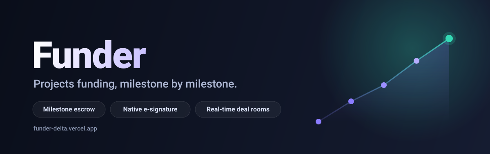

<h1 align="center">Hi, I'm Iratus 👋</h1>

I build full-stack web applications — end to end, from database and auth to real-time UI and production deployment.

 

## 🚀 Featured project — Funder

  

A two-sided **startup funding platform** where founders raise capital **milestone by milestone** and investors release funds from escrow as each milestone is delivered and approved. Full-stack, fully bilingual (English / Arabic with RTL), and deployed to production — with real-time deal rooms, native in-app contract e-signing, and a security-first Postgres data layer.

  
  &nbsp;
  

---

## 🛠️ What I work with

  
  
  
  
  
  
  
  
  
  

---

💬 Want a walkthrough of any project? Open an issue on a repo, or reach out on GitHub.

